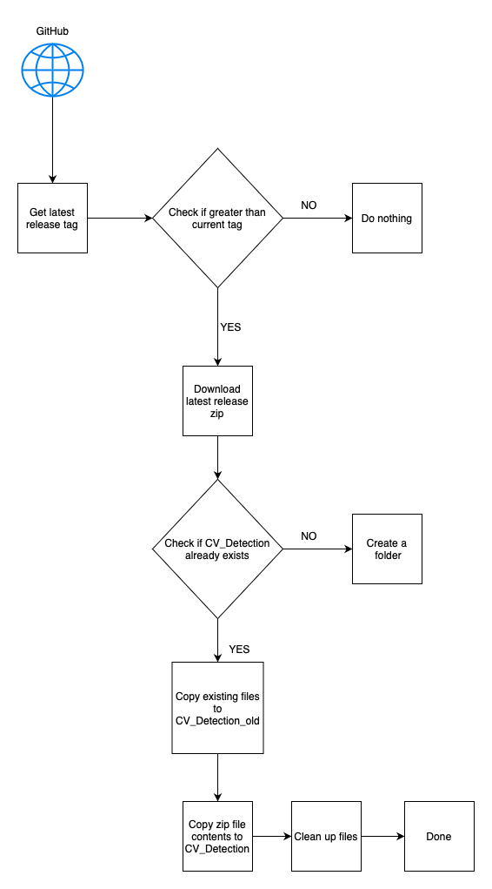

# Jetson release autodownloader
- Last part of the continuous deployment pipeline. Jetson has a crontab running that checks for the latest github release every 24h
- On finding the latest release, it downloads the code.
- The current release is shadow copied to a another folder
- The latest code is then shifted to the CV_Detection folder
- Cleans up redundant files.

     

